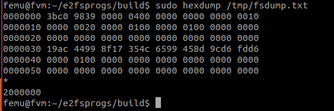
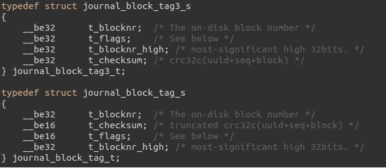
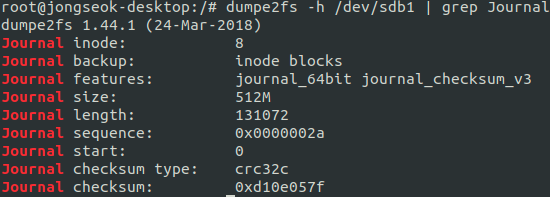
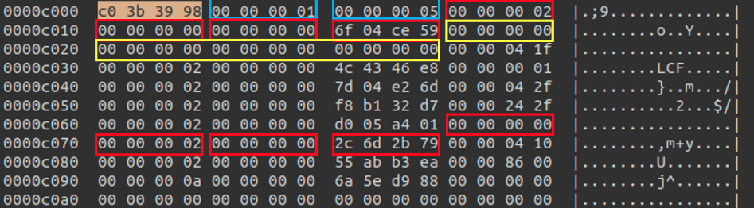

O `debugfs` é uma ferramenta disponível no Linux Kernel desde a versão `2.6.10-rc3`
cuja sua função é para debugar os sistemas de arquivos `ext2/3/4`.

## Como utilizar?

Primeiro, inicie o `debugfs` apontando para a partição que você deseja verficar:

```bash
sudo debugfs /dev/nvme0n1
sudo debugfs journal_open
```

Entã,o, você pode exibir informações específicas de `inodes` para um arquivo,
como no caso do `inode-8` que é o `journal` do sistema de arquivos:

```bash
dump <8> /tmp/fsdump.txt
```

Agora você pode ver o conteúdo deste `inode` específico que, no nosso caso, podemos
utilizar o `hexdump` para melhor visualizar os dados.

```bash
sudo hexdump /tmp/fsdump.txt
```

E teremos o resultado abaixo:



Veremos que este bloco representa o `journal-superblock` do `journal` em questão.

## Análise dos dados do `journal`

Antes de analisar os dados do `journal`, vamos entender como funciona o `journal_block_tag_t`. Existem
os `journal_block_tag_t` e e o `journal_block_tag3_t` conforme figura abaixo:



Você pode checar as _features_ do `journal` utilizando o `dumpe2fs`:

```c
dumpe2fs /dev/vdb | grep Journal
```

### Exemplo de análise

No primeiro exemplo, obtemos o resultado via `dumpe2fs` conforme figura abaixo. Então podemos
saber facilmente que ele possui um `journal_block_tag3_t` por causa do `journal_checksum_v3`:



A figura abaixo mostra o descritor que pode ser visto no início da transação no `journal`. O
mais a esquerda `0000c000, 0000c010` representa o endereço relativo considerando que o `journal`
inicia em 0:



Laranja apresenta o `magic number`. Isso pode ser visto no `journal` no início de um bloco especial.
O primeiro retângulo azul claro indica o tipo dos blocos especiais. `1` indica que é o `descriptor block`,
o ponto inicial da transação, `2` indica o bloco de `commit`, `3` ou `4` indicam o `journal superblock`.

Os próximos quatro retângulos vermelhos são os valores dos dados das `tags` para os blocos de dados. Sabemos
anteriromente que este `journal` possui a _featue_ do `journal_checksum_v3`. Por isso que uma `tag` consiste
de `blocksnr` (4-bytes), `flags` (4-bytes), `blocksnr_high` (4-bytes), `checksum` (4-bytes), e cada um
dos retângulos vermelhos representam isso.

A caixa amarela é o `journal UUID` de 16 bytes. Ele normalmente será zero, a não ser que você configure o
`journal` para trabalhar em outro disco.


